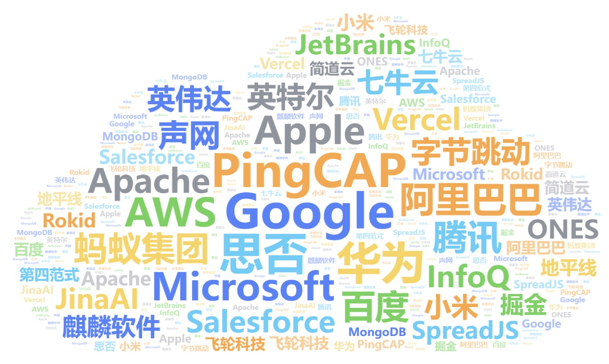

# Ⅴ. 中国デベロッパー・リレーションズ・ケースブック

今回のアンケートでは、DevRel分野で顕著な功績を残した企業・団体について、「今のところない」等の無効回答を除き、回答者の頭の中にある企業・団体名を記入してもらい、合計878件の回答を得た。 回答者が挙げた企業名と頻度に応じて、以下のようなワードクラウドを作成した：

その中で、最も言及された企業は、Google（Google Cloudを含む）が119回、PingCAP（TiDBを含む）が105回、SiNoが98回、Huawei（Huawei Cloud、Hongmeng、Huawei Developer Allianceを含む）が93回、Amazon Cloud Technologyが56回、Appleが49回であった、 マイクロソフトは49回、アリババ（阿里雲を含む）は42回、テンセント（テンセントクラウドを含む）は36回、バイドゥ（バイドゥクラウド、バイドゥフライングパドル、アポロを含む）とアントグループ（アントデザイン、アントオープンソース、SOFAを含む）は31回言及された。

新興企業では、PingCAP、JinaAI、Flywheel Technology、ONESが輝いた。

以下のコンテンツでは、上記企業の一部（PingCAP、SegmentFault、Huawei、Amazon Cloud Technology、Ant Group）から、企業のオープンソース戦略、ソフトウェアの海外展開やグローバルコミュニティの構築、開発者センターの構築、開発者サークルの運営、開発者イベントの開催など、様々な側面からDevRelが厳選した事例を取材・執筆した。

## 目录索引
1. [SegmentFaultはどのようにハッカソンを通じて企業の開発者エコシステムを強化するか？](https://github.com/segmentfault/china-devrel-report/blob/main/china-devrel-report-23/Part5/case1-sf-hackathon.md)
	1. ハッカソンの種類と生態学的価値
	1. 質の高いハッカソンを開催する方法

1. [ユーザー自律型の知識ベース開発者コミュニティを作る SegmentFault](https://github.com/segmentfault/china-devrel-report/blob/main/china-devrel-report-23/Part5/case2-sf-qacommunity.md)
	1. SegmentFaultコミュニティの威信：ユーザーコミュニティの貢献度を測る
	1. SegmentFaultコミュニティ利用者の権利: 評判の高い利用者がコミュニティ運営に参加する。
	1. SegmentFaultコミュニティのバッジシステム：真面目な知識ベースのコミュニティのための卵。
	1. プレステージ＋ユーザーの権利＝オープンソース的コミュニティのユーザー成長システム

1. [ファーウェイ・クラウド自律ストリーミング・デベロッパー・サークルオペレーションズ](https://github.com/segmentfault/china-devrel-report/blob/main/china-devrel-report-23/Part5/case3-HC-operations.md)
	1. ファーウェイクラウドストリーミングの開発者サークル設計
	1. ファーウェイクラウド開発者サークル運営戦略
	1. ファーウェイクラウド開発者サークル運営の効果と今後の計画

1. [技術リーダーのコミュニティ「TGO KUNPENG SOCIETY(TGO 鲲鹏会)」の運営](https://github.com/segmentfault/china-devrel-report/blob/main/china-devrel-report-23/Part5/case4-tgo.md)
	1. TGO 鲲鹏会の歴史と現状
	1. TGO 鲲鹏会のコミュニティ・ガバナンス

1. [開発者教育を推進する昇腾AI](https://github.com/segmentfault/china-devrel-report/blob/main/china-devrel-report-23/Part5/case5-HW-ascend.md)
	1. 昇腾AI「学習-育成-コンテスト」は、全サイクルで開発者の成長を後押しする。
	1. 昇腾AI イノベーションコンペティションのイベントデザイン
	1. 昇腾AIの「成長競争」実績

1. [アント・グループOSPO：オープンソースを企業技術成長の新たな原動力に](https://github.com/segmentfault/china-devrel-report/blob/main/china-devrel-report-23/Part5/case6-ant-ospo.md)
	1. アント・グループOSPOの設立と発展
	1. アント・グループOSPOの探索と実践
	1. アント・グループOSPOの仕事の有効性
	1. アント・グループオープンソースの将来展望

1. [世界的なクラウドコンピューティングリーダーAmazon CloudTechの地域開発者コミュニティ構築](https://github.com/segmentfault/china-devrel-report/blob/main/china-devrel-report-23/Part5/case7-aws-communitybuilding.md)
	1. アマゾンクラウドテクノロジー中国開発者コミュニティのチャンスと課題
	1. アマゾンクラウドテクノロジー開発者コミュニティ公式サイト開発戦略
	1. アマゾンクラウドテクノロジー開発者コミュニティ公式サイト構築実績

1. [コミュニティ主導、PingCAPのグローバルオープンソースエコロジー構築とビジネス成長](https://github.com/segmentfault/china-devrel-report/blob/main/china-devrel-report-23/Part5/case8-tidb-globalization.md)
	1. オープンソースコミュニティの成功：TiDB Growth Flywheel
	1. 商業化の探求：DevRelは企業のSLG＋PLG戦略の実現を可能にする
	1. 大海原への船出：グローバル化された製品＋ローカル化されたコミュニティ
