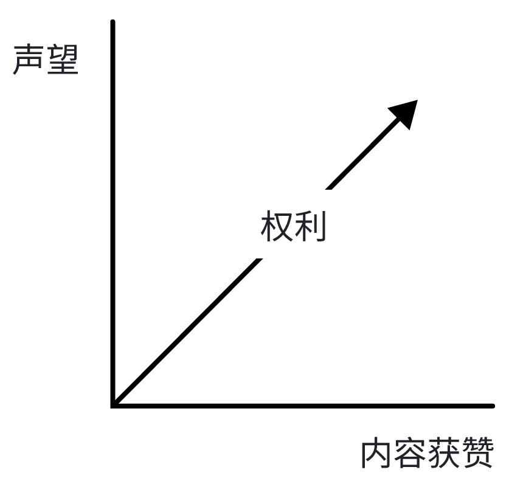
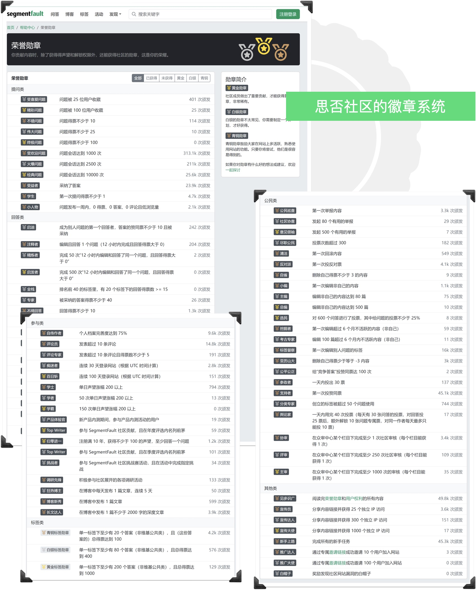
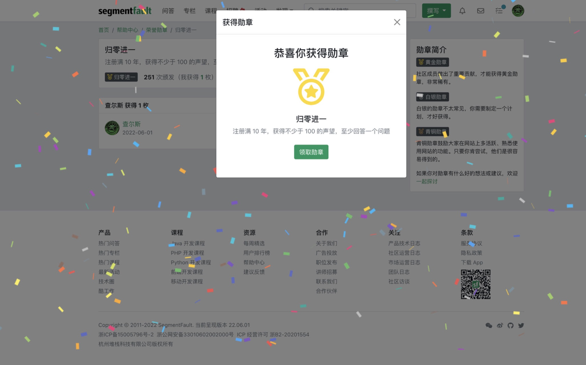
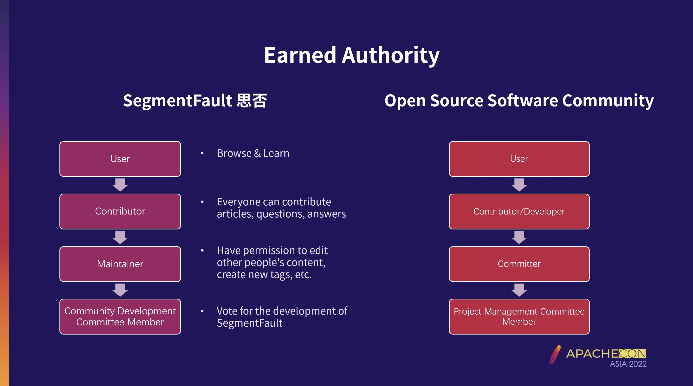

# 打造用户自治的知识型开发者社区 SegmentFault 思否

> 开发者社区是企业构建和发展健康开发者关系的抓手，构建和运营一个活跃的开发者社区是 DevRel 工作的一个主要焦点，因为它提供了一个平台承载产品或服务的各类技术资源，同时让开发者能够交流想法、分享经验、解决问题，并与产品或技术形成深厚的联系。 搭建一个开发者社区看似并没有太高的技术门槛，然而真正活跃的社区却寥寥无几。这往往是因为社区的运营者只将目光局限于流量增长和营销活动，忽略了能够让社区保持长久生命力的底层机制设计。一个合格的社区运营者应该从社区规则出发，通过建立社区声望值等用户成长和激励体系，使社区中形成一种用户互助的氛围。
> 
> 同时，良好的规则可以使社区逐渐进入一种用户自治的良好生态，不仅能够节约大量企业的社区管理人力，也可以大大提升用户的参与感、荣誉感和忠诚度。 成立于 2012 年的 SegmentFault 思否在激烈的流量竞争中，后发制胜快速成长为国内最大的技术问答社区，就源自于其出色的社区治理机制。目前 SegmentFault 思否社区中已经有 3,000 余位用户加入了众审中心的日常内容审核和争议内容裁定并获得相关勋章奖励。在这一案例中，SegmentFault 思否的产品设计合伙人董锋将首次公开思否社区的声望权利与社区治理体系。

SegmentFault 思否是一个面向开发者群体的问答社区，目的是为了互助解决编程相关的问题。一群人提问，另一群人回答。技术问答有一个很大的特点，就是要求严谨和准确。早期的种子用户通常技能全面，问题清晰，回答者也能快速解决问题，内容通俗易懂、排版美观。管理员甚至不需要做任何编辑干预，即可生产一条完整的问答。

但当社区开始逐步发展，慢慢浮现出一些新的问题：

* 用户数量的上升带来内容量和知识面的上升，也带来了内容质量的下降。这个时期，靠增加管理员做内容维护是一项艰难的任务 —— 在技术群体中，谁技术好就服谁，热心的开发者们可以通过帮助别人收获成就感，但他们并不会把社区运营或者技术编辑作为自己的首选职业。

* 社区用户具有流动性，有人加入就会有人离开。知识型社区和传统论坛的最大区别是前者重视的描述客观事实，后者更多描述主观看法。因此即使内容的原始作者离开了，他贡献的内容仍有延续的意义，而这些内容需要不断迭代更新。

因此，在社区快速发展的阶段，SegmentFault 思否引入了维基百科协作的概念，让社区的志愿者参与维护。这个概念的实行需要从三个维度建立，分别是声望、权利、徽章，下文我们将逐一展开。

## 思否社区的声望值：用户社区贡献的衡量标准

社区通常有一个类似积分的概念，思否社区将之称作声望值，用来衡量用户在社区的贡献，也可以理解为用户在社区的可信度。内容是知识型社区的核心，声望值主要通过发布有价值的内容获得其他用户的投票认可而获得，声望值的其他变化也是围绕内容展开，如：

- 用户生产的内容获得赞同票和被采纳时声望会加分；
- 用户产生的内容收到反对票时声望会减分；
- 用户对别人的内容进行编辑并被接受后会被加分。

详细的声望值规则如下所示：

### 声望增加规则

| 条件                               | 得分 | 备注                                     |
|------------------------------------|------|------------------------------------------|
| 回答被采纳                         | +15  | 采纳自己的答案不加声望                   |
| 回答被赞                           | +10  |                                          |
| 问题被赞                           | +10  |                                          |
| 编辑问题和回答（包含维基）通过审核 | +2   |                                          |
| 标签编辑被采纳                     | +2   |                                          |
| 采纳他人答案                       | +2   |                                          |
| 新用户激活                         | +1   | 未激活用户初始声望为 0，激活后声望变为 1 |

###  声望减少规则

| 条件                                                      | 得分 | 备注 |
|-----------------------------------------------------------|------|------|
| 对他人的回答投反对票                                      | -1   |      |
| 问题或回答被投反对票                                      | -2   |      |
| 回答被删除（包括自己删除）                                | -5   |      |
| 你发布的某条内容收到 ≥ 6 次原因是垃圾、违规或不友善的举报 | -100 |      |
| 你编辑的问题和回答（包含维基）没有通过审核                | -2   |      |

更多规则详见：https://segmentfault.com/a/1190000040650806

社区鼓励开发者分享擅长技术领域的开发经验、帮助遇到技术难题的开发者答疑解惑、乐于思考并提出疑问，鼓励大家友善的互助交流。用户产生的内容越有价值，对社区的贡献就越多，越符合社区的公民形象，解锁的社区功能权限和权益也就越多，这也意味着用户可以更深度的参与社区建设和决策，例如决策社区内容，成为社区真正的建设者和主人。这就进入到我们的第二个维度，用户权利。

## 思否社区的用户权利：高声望用户参与社区管理

为了让用户行为和权利在社区的共识下运作，避免权利滥用，引发秩序混乱，社区需要对权利进行划分。

SegmentFault 思否定制了社区的各项规则和准则，将权利按影响程度分成多个层级，定义每项权利的行使范围，影响越重大的权利，要求的声望值越高。

同时，思否建立了众审中心，重点从维护内容质量方面做了权利开放：

- **发布预先审核（低声望要求）**
  - 确保提问的完整性，避免问题遗漏关键信息导致无法回答，提高内容的可理解性；
  - 减少提出重复问题、重复回答，尽可能的保证内容聚焦；
  - 过滤垃圾信息和不恰当内容，维护社区的专业形象和优质内容。
- **内容编辑优化（中声望要求）**
  - 低门槛的编辑权限，能获得快速反馈与纠正的能力，使得内容能够及时更新和进化；
  - 为了保证可靠性，增加了多人投票审查环节决定是否生效，能够防止破坏性的编辑；
  - 保留了历史版本，记录变更历史，以便回溯或还原。
- **争议内容处理（高声望要求）**
  - 通过投票识别、改进或删除低质量内容；
  - 通过投票关闭不符合要求的问题等。
  

通过以上方式，内容经过“众审中心”车间加工后质量有了明显提升，社区氛围也有了改善。目前，SegmentFault 思否社区中已经有 3,000 余位用户加入了众审中心的日常内容审核和争议内容裁定并获得相关勋章奖励。

## 思否社区的徽章系统：严肃知识型社区的彩蛋

声望和权利营造了一个充满规则的铁面社区，时间长了会限制用户参与的积极性。SegmentFault 思否引入了徽章系统，徽章系统可以从以下方面激励用户：

- 激励用户参与和贡献：徽章是一种可见的荣誉标志，它们鼓励用户积极参与社区活动，如回答问题、提问、编辑答案、参与社区维护等。徽章的获得需要一定的努力和贡献，这会激发用户的积极性和愿望，促使他们更加活跃地参与社区。

- 表彰用户成就和专业知识：徽章代表了用户在特定领域的专业知识和经验。对于拥有某些特殊徽章的用户，其他人可以将他们视为该领域的专家，并更容易信任和依赖他们的答案和意见。徽章为用户树立起了一种可信度和声誉，提高了他们在社区中的地位。

- 增加用户互动和竞争性：徽章为用户之间创建了一种竞争和互动的环境。用户可以通过获取更多徽章来展示自己的能力和经验，并与其他用户进行比较和竞争。这种互动和竞争能够增加用户的参与度和活跃度，进而促进社区的成长和发展。

徽章的存在建立了一种竞争性和互动性的环境，徽章系统可以激发用户的积极性，鼓励他们回答问题、提问、编辑答案等参与行为。徽章的获得需要一定的努力和贡献，用户为了获得会下意识行使自己的社区权利。这样可以提高用户的参与度和活跃度，并树立他们在社区中的可信度和声望。

## 声望值+用户权利 = 类开源社区的用户成长体系

声望、权利和徽章是 SegmentFault 思否社区运作的核心机制，在社区中的作用被广泛认可和接受，这对于以内容为核心的开发者社区、论坛而言具备一定的借鉴意义。由 SegmentFault 思否开源并捐赠到 Apache 软件基金会的问答软件 Answer 在功能设计上也融入了这部分的思想，是企业或组织构建其线上社区、Help Centre、资源中心的理想工具。

此前，SegmentFault 思否 COO 江波也曾在 ApacheCon Asia 的演讲中将这一体系与开源社区中的用户成长体系做对比 —— 从用户到贡献者，开发者通过社区贡献不断积累社区声望拥有更多权限，进入到项目的管理委员会（在开源社区）或解锁众审中心的高级管理权限（在 SegmentFault 思否），这其中的精髓是贯通的。因此我们也认为，这一案例对于非内容型的社区运营（如用户社群、开源社区等）也具备参考价值。

*注：感谢 SegmentFault 思否产品设计合伙人、Apache Answer PPMC 成员董锋，在本案例撰写过程中接受了我们的访谈*
