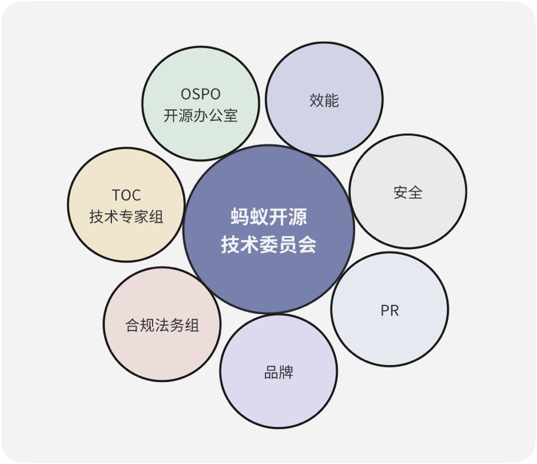
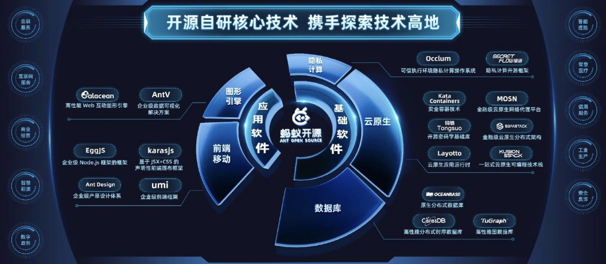

# 蚂蚁集团 OSPO：让开源成为企业技术增长新动力

>伴随着开源技术在千行百业的应用，越来越多企业开始设立开源办公室（OSPO），对内制定开源战略、开展合规治理、赋能开源项目，对外进行企业开源技术品牌的传播。 2021 年初，蚂蚁集团成立了开源办公室。2023 年 5 月，蚂蚁集团首次公布以关键基础软件为核心的开源完整版图，推动基础设施技术全面开源，其中包括分布式数据库 OceanBase、隐语隐私计算技术栈、TuGraph-family 图平台、密码学技术“铜锁”等核心自研技术。蚂蚁开源的全面发展背后，开源办公室扮演了至关重要的角色。 然而，OSPO 在中国依旧是个新兴且小众的组织机构，OSPO 可以在企业技术创新中扮演怎样的角色？开源又可以为企业技术增长带来怎样的价值和意义？我们将以蚂蚁集团开源办公室的演进之路为案例，尝试给出答案。

## 蚂蚁集团开源办公室的成立与发展

### OSPO 的诞生：萌芽于野蛮生长的业务需求中

在一个大型企业中，开源往往自下而上，萌芽于多个业务团队之中，蚂蚁集团也是如此 ——

前端领域是蚂蚁开源的先驱，最知名的当属 Ant Design 项目，在 SegmentFault 思否开发者社区仅 antd 相关标签下就有超过 4000 余条技术问答和专栏文章。从 Ant Design，EggJS 到 AntV，蚂蚁的开源项目开始在社区中展露头角。在社区中收获到正反馈，也推动公司内部慢慢形成良好的开源氛围和对开源的认知和兴趣。

第二阶段，随着蚂蚁集团在 ToB 业务的探索，SOFAStack 的全面开源，从以企业为中心到以社区为中心，带动了云原生网络代理 MOSN，机密计算 Occlum 等诸多业务型后端项目的大规模实践探索。在这个阶段，虽然有着很多的项目尝试去开源，但开源更多的是一种需要去推动的选择。

第三阶段从 2021 年 6 月 OceanBase 开源开始，OceanBase 是蚂蚁集团自研的一款分布式数据库，在之前的十年里主要是在蚂蚁集团内部使用，经受了双十一等大规模分布式场景的实战考验。OceanBase 意识到开源能够拉近用户和产品研发团队的距离，通过更广泛的用户触达和沟通筛选出更加确实的产品价值需求，也能帮助核心功能的易用性打磨，在 2021 年选择了开源。2021 年下旬，蚂蚁集团推出了「蚂蚁开源」品牌，标志着蚂蚁进入到了以战略牵引结合业务诉求开源的新阶段。

蚂蚁集团开源办公室是这一战略探索阶段的产物。企业开源办公室的出现和发展，往往标志着公司开始对开源这一技术战略有了系统性的思考。从社区萌芽、业务探索到战略选择的过程，往往也是开源在企业内部自下而上、无畏探索、野蛮生长的过程，这一过程会积累一些问题和风险。几经浮沉，慢慢公司内部会对这个“痛点”有所感知，继而有所认知，然后形成需求，希望建立一个组织来系统性地给予指导、治理和运营，甚至统筹相关业务，这便是企业开源办公室的最初雏形。

### OSPO 的发展沿革：从支持型团队向业务型团队的转型

伴随着企业开源战略的逐渐明确，蚂蚁集团开源办公室的演进大致经历了三个阶段 ——

- **2021 年，蚂蚁集团成立开源办公室，主要职责：治理**

2021 年 2 月，蚂蚁集团宣布正式成立开源办公室。萌芽于业务需求中的 OSPO 在当时主要聚焦于解决问题，尤其是从 0 到 1 完成内部治理的相关工作，比如建立内部相关机制流程，以避免敏感信息泄露、合规知识产权法律风险等，以及通过评价体系的建立，避免目标不清、质量不高、投入缺乏保障的开源。

- **2022 年，开源成为公司技术战略，主要职责：项目赋能**

2022 年，在过去一年的基础上，蚂蚁集团开源办公室的职能从偏治理型工作向偏运营型工作转型。其主要工作是帮助公司内部重要项目做开源冷启动筹备工作，生态拓展，提升开发者体验，构建更健康可持续发展的开源社区，并推动项目在开放生态下持续创新。直至 2022 年下半年，蚂蚁集团将开源上升为集团战略，在前两个阶段中，开源办公室扮演的都是一个“能力中心”和横向支持型团队的角色。

- **2023 年，开源战略进一步明确，主要职责：开源技术品牌与整体项目孵化**

2023 年，蚂蚁集团进一步明确了开源战略。开源办公室也在开源技术委员会的引导下，转变为专注于技术增长的业务型团队。战略中明确了蚂蚁集团要持续建设其开发者生态，打造具有国际影响力的开源技术品牌，孵化出一定数量的被社区认可的顶级项目。进入第三阶段，我们可以发现，蚂蚁集团开源办公室除了扮演企业核心治理中台和运营中台的角色外，也拥有了自己独立的使命和目标。

## 蚂蚁集团开源办公室的探索与实践

### 发展使命：让开源成为企业技术增长新动力

全新定位下的蚂蚁集团开源办公室，致力于让开源成为企业技术增长的新动力。

在 2023 年 9 月的外滩大会上，蚂蚁集团开源技术委员会副主席王旭曾在分享蚂蚁集团开源战略时谈及技术增长，在他看来对于企业来说，开源有四重价值：机制、影响力、信任、社区。这四重价值由内到外，再从外驱动内部，从而形成社区驱动的增长。而聚焦在开源办公室的使命上，他们的技术增长将主要聚焦于两个方面，一是数量的增加，二是质量的提升。

- **数量维度：使用技术的人数是很多业务商业模式的一个底层逻辑。在其他条件不变的情况下，认可的人数越多越好。**

以阿里云业务为例。阿里云数据库技术被做成产品，然后通过云的渠道销售出去获取利润。这个利润本身是由技术带来的。核心是客户认可这个技术，能够帮他们解决问题，因此他们愿意为这个技术付费。如果有 20% 的人认可并购买某个云厂商的技术，其中大约 80% 的人就会成为它的长期用户。云厂商可以基于大家对技术的认可形成一个长期的、可持续的技术发展，从而为公司带来效益。

- **质量维度：开源是催化剂，而不是化学反应本身。催化剂有两个作用，让不可能发生的化学反应发生，或者让发生的化学反应更高效。**

以 OceanBase 为例，OceanBase 在 2021 年开源后，目前社区版本的质量很高，拓宽了原本需要用销售来拓展的应用场景，降低了获客成本，增加了实际使用的用户规模。另一方面，蚂蚁集团将 OceanBase 的 300 万行代码全部开源，吸引了一些数据库领域的大拿。他们能够直接看到 OceanBase 的内部实现，从而增加技术信任，更进一步提升品牌信任。

###  组织职责：合规安全、降本增效、业务发展

为了实现这一使命，蚂蚁集团开源办公室拥有三大职责。

**蚂蚁集团开源办公室的第一个职责是帮助公司内部完成软件开源，保证合规安全。** 对外开源是个复杂的过程，也不是一个单独的过程。项目开源涉及到的业务决策，安全决策，合规决策等，开源办公室的价值在于可以根据我们想达到的最终目标，系统性打造需要跨团队协同才能完成的系统和工具。OSPO 成立初最主要的工作就是打造这一套机制，然后明确开源的“几要几不要”，给与正确的引导和关键风险的潜在警告。

**第二个职责是从整体层面将开源合作范式抽象形成最佳实践，实现降本增效。** 开源办公室会帮助内部更好地使用开发者工具，更专业地与社区沟通、与外部的开发者合作，更有效地写代码、Review 代码，在社区意见一致或意见不一致的情况下讨论技术实现，并在架构层面形成一整套的工程体验和流程设计，达成降本增效的业务效果。

**第三个职责是促成成熟开源项目与外部开源社区、基金会协同的开放生态，推动业务发展。**

在组织设计上，蚂蚁集团设有开源技术委员会，下设开源办公室。在部分企业内部，这类组织多为虚拟组织，组织成员由内部员工兼任。而蚂蚁集团则选择了实体组织结合横向团队配合的设计，开源办公室由全职员工运营，横向合作技术专家组、法务合规组、安全组、品牌组、PR 组等专业领域团队。

### 化解标准化与个性化的矛盾：打造具有足够生命力的通用性解决方案

蚂蚁集团开源办公室主要通过将开源相关工作中台化，形成能提供专业能力的团队，服务公司整体开源业务，并利用自身专业能力为需要重点取得突破的项目提供贴身服务。目前，蚂蚁集团开源办公室已经打磨出了一个标准化的解决方案，但在日常实践中仍然面临着两个挑战。

**一个是各项目组对开源的认知水位参差不齐，无法只依靠一个标准化的解决方案解决所有问题，** 比如：部分项目组只需要提供给他们一个简单的案例就可以顺利地将项目开源；有些项目组却更需要一个为他们量身定制的解决方案。**但另一个挑战也随之而来，即如何把支持通用性需求的时间成本压到最低，以专注帮助那些定制化服务的项目。**

为了达到这一目标，最大限度发挥通用性方案与个性化方案的效果，蚂蚁开源提供了基础文档和完整的系统，在全局层面解决绝大多数问题，并通过主动的迭代和被动的调整持续完善内容。其中，文档本身是一个自服务型“产品”，有很强大的生命力，细致到包括如何做商标，如何设计许可证，如何在公司内部以安全合规的方式把代码开源出去，甚至小众领域的项目也可以提供相应的案例，完善的方法论，以及社区运营规划，能够为公司所有项目开源提供服务。

## 蚂蚁集团开源办公室的工作成效

经过近 2 年的探索，蚂蚁集团开源办公室已经初步帮助内部实现了“有信心、有目标”地开源，在内部建设和外部探索上都取得了一定成效。

### 内部建设成果

目前，**蚂蚁集团开源办公室在对外开源领域，已经拥有了一个能够持续产出优质开源项目开源的技术底座。** 这个技术底座里面包含两个部分，一个部分是蚂蚁集团有一个治理机制非常完备的开源技术委员会，蚂蚁集团对待每一个开源项目都非常谨慎，开源技术评估小组有专门的打分表，从技术先进性、安全性、潜在风险、开源价值（社会价值和商业价值）、成本、是否遵守开源许可等诸多维度进行评估。同时，蚂蚁集团自研了静态扫描、代码分析等一系列工具帮助提高审查效率。另一个部分是在开源使用和引入层面，OSPO 一般是作为业务和安全侧的“开源专家支持”出现，以人为本的角度去考虑开发者的体验。目前 OSPO 对于公司内部开展的开源引入合规场景，在方法论以及工具设计等方面，已经有了很系统的沉淀。此外蚂蚁集团内部也打造了很多分层培训课程供不同需求的开发者学习。

最难的部分是培养项目以及与外部生态融合。国内开源的整体状态，还是在一个“以用为主”的阶段，对于“贡献开源”的提倡，有很大的进步空间。开源“回馈上游，异步沟通，重视文档”等方法论，可以在内部直接服务到技术开发效率和技术文化。当开源的文化和精神能够融入到技术文化中，并与业务场景的挑战有机结合之后，很容易系统性的批量孕育出优质开源项目。目前，**蚂蚁集团每次开源上会的项目，较之去年有 50% 的量的提升和明显的质变提升**。同时，蚂蚁集团 2020 年沉淀的“内源社区”也在持续发挥造血功能，有潜力成为集团内部的开源孵化器。

### 对外探索成效

开源项目是企业技术能力的一种外在投射。**蚂蚁集团开源办公室通过 2 年的努力**，成功地让外界对于蚂蚁集团的技术和蚂蚁集团开源出来的技术形成了一个较为完善的认知，并且通过工作的专业性和项目的质量，**让大家认可了蚂蚁集团的开源能力和开源水平**。

**开源办公室也让外部对于蚂蚁集团在开源社区的贡献建立了更全面的认知**。在 OSPO 成立之前，蚂蚁开源在国内外产业生态中就有很多合作。蚂蚁集团是 Openlnfra Foundation 的白金会员，也深度参与了 Linux Foundation，CNCF，Confidential Computing Consortium 等开源机构并开展合作。OSPO 成立之后，蚂蚁开源进一步增进了与国内开源生态的沟通与合作，追求长期的项目合作共赢。蚂蚁集团与开放原子开源基金会、CCF 开源发展委员会、木兰社区等均形成了长期的合作规划，活跃在 OSCAR 的可信开源联盟，积极参与电子技术标准化研究院、中国信通院、金融领域标准机构牵头的各项开源标准。新的合作和业务拓展也在规划落地中。

*（注：内容成稿于 2023.5，部分新开源项目等尚未被收录）*

目前，蚂蚁集团有着 20 多个头部项目，1900 多个项目仓库，贡献者总数已达 7000 多人，综合项目活跃度和影响力均在国内名列前茅。

## 蚂蚁开源的未来展望

在 SegmentFault 思否 2021 和 2023 年的中国开发者关系从业人员现状调研中，企业对于开源、开发者战略的稳定性，以及对于相关工作的价值度量一直是困扰相关从业者的两大难题。而蚂蚁集团在开源战略上的思考，以及蚂蚁集团开源办公室在相关领域的实践，可以为相关企业提供一个很好的参考范例。

展望未来，蚂蚁开源还有 3 点小而美的目标 ——

1. **坚持以人为本**
相比之前希望用通用的方法帮助项目更好地运营，蚂蚁集团开源办公室更希望把整体开源能力赋予项目组。蚂蚁开源希望秉持以人为本的理念，通过帮助开发者参与开源、理解开源、认可开源，从而相信蚂蚁、选择蚂蚁，让蚂蚁集团成为国内开发者做开源很好的一个选择，让蚂蚁开源成为开源开发者的初恋。通过培养更多的开源人才，让更多开源人才去贡献更多的开源项目。

2. **回归好玩本质**
开发者持续参与开源的动力中往往忽略最开始做 Linux 的心态——Just for Fun。在今年的外滩大会上，蚂蚁开源通过开源市集、开源剧本杀等有趣的小活动吸引了大批开发者的关注，成功出圈。开发者在贡献开源获得成长的同时还能获得趣味，是一个很好的方式。蚂蚁集团开源技术委员会副主席王旭表示，不一定每一个项目都有那么多商业氛围在里面，其实开源也有很多文化层面的东西在里面，应该让大家愿意去互动，愿意去分享。“开源这件事情，我们还是想做得好玩一点。”

3. **解决实际问题**
蚂蚁集团开源办公室正是通过不断解决实际问题，为公司带来了价值，获得了更多的支持，从而能够在这些年稳步增长，去解决更多的问题，帮助到更多的人，这种实际问题并不仅仅包含业务问题，也包括通过技术和代码开源可以解决的社会问题。比如 2023 年蚂蚁集团开源了生僻字解决方案「汉字拾光计划」，它可以为中国现有的数千万因为生僻字被拦在整个数字银行、数字政务体系之外的用户提供帮助，这种有社会责任感的开源，也将是蚂蚁开源一直坚持的努力方向。

*注：感谢蚂蚁集团开源办公室负责人边思康，在本案例撰写过程中接受了我们的访谈；*
*本文部分内容引自中国信通院云计算与大数据研究所可信开源在 2023 年 9 月发布的 2023 OSPO 案例汇编第二期。*
