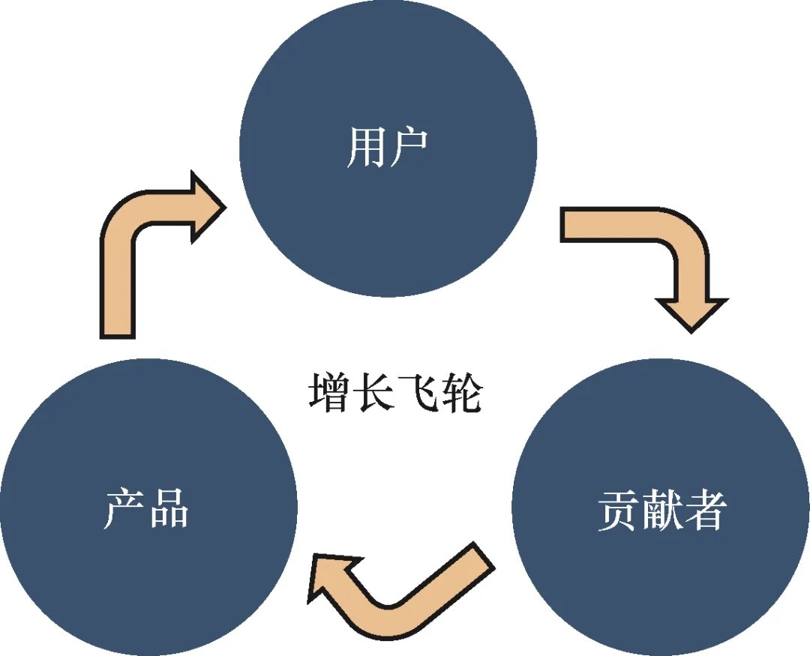
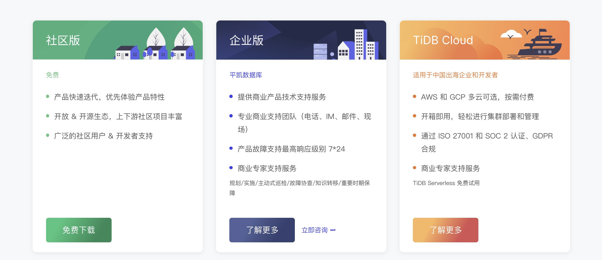
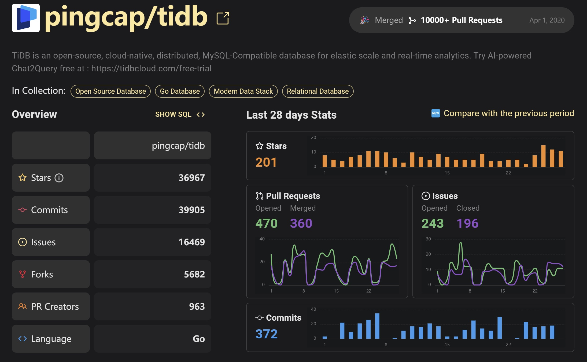

# 社区驱动，构筑 PingCAP 的全球开源生态与商业增长

> 在数字化浪潮的驱动下，开源社区已成为创新的重要发源地。依托高度活跃的开源社区，TiDB 持续扩展丰富的应用场景，迅速成为由国人主导的国际顶级开源分布式数据库项目。PingCAP 更是将开源作为公司核心战略，与全球化战略共同推进，积极推动中国数据库产品在全球取得技术领先和商业认同，一度创下了该细分领域最高融资记录。 
>PingCAP 的成功故事，生动诠释了如何通过开放的协作模式，构建起一个自我增强的生态系统。从 DevRel 的视角来看，这不仅仅是技术上的突破，更是一种市场和社区参与策略的演进。本文将探讨 PingCAP 如何在秉持开源精神的同时，通过精心设计的开发者关系（DevRel）实践，来不断地推动他们的产品、用户群体和贡献者之间形成一种独特的增长飞轮效应，最终促进了企业的持续创新和商业成功。

## 开源社区成功：TiDB 增长飞轮

在 PingCAP 的理解中， 开源社区由产品（Product）、用户（User Base）和贡献者（Contributor）这三大部分构成。这三个组成部分并非静态存在， 而是形成了一个不断循环转动的飞轮。

简单来说，开源社区足够多的场景验证并推动产品研发往正确的方向迭代， 一个更快速迭代和符合用户需要的产品又降低了大家采用它的门槛和成本， 进而进一步促进用户数量的增长。每次飞轮的转动都带来更广泛的应用场景、更成熟的产品和更强大的社区。

PingCAP 社区生态的工作也是围绕这三个元素展开，社区运营团队在内部也经历了 3 个不同阶段的角色转换，第一个阶段他所带领的团队主要聚焦于开源社区，专注提升开源代码贡献者的协作体验；第二阶段在 PingCAP 开始尝试商业化后，针对开源代码贡献者的运营工作占比开始下降，更偏向于服务整个开源社区的用户，帮助他们将 TiDB 的社区版本用在相应的生产环境中；而现在进入了第三个阶段，他们回归产品的本质，目标聚焦在使用产品的 End User，致力于提升产品的使用体验，关注开发者体验与开发者关系。

实际上，在这个增长飞轮中，最核心的便是开发者体验 —— 好用决定了漏斗的转化率，也是驱动飞轮开始旋转的最核心力量。

## 商业化探索：DevRel 助力企业实现 SLG + PLG 策略

作为一家基础软件公司，仅仅社区成功是不够的，如何让社区成功催化商业成功，是每一家开源商业公司成长路上绕不开的难题。而 PingCAP 的商业化策略，我们则可以通过其产品的交付形态窥得一二。

PingCAP 目前已经形成了社区版+企业版+云上版本的产品矩阵。

- 通过社区版快速迭代产品：PingCAP 一边通过社区版保持敏捷的发版节奏适应快速变化的市场需求；一边通过开源项目 TiDB 及其开源社区内丰富的内容和活动持续吸引目标用户认识产品并产生兴趣，进而影响价值评估和采购决策；

- 通过企业版提供稳定服务：经过真实业务场景打磨的产品，能够为目标用户提供更稳定、高可用的服务和创新支持，完成价值交付；

- 通过 Cloud 版辐射全球： TiDB Cloud 依托云技术提供了开箱即用的 DBaaS 服务，将整个 PB 级别的数据库服务平台价值进一步放大。

**以中腰部客户的用户旅程设计为例**，PingCAP 的做法是，在早期为用户提供免费的额度，引导客户深度感知产品、用好产品，维护他们的产品开发体验；等到用户真正将产品用起来，业务增长起来，再将其转为销售线索去跟进，以形成更高效的商业模式。

实践证明，单纯依赖大客户销售驱动增长（SLG）模式在市场逐渐饱和时可能会遇到增长瓶颈，同时用户获取成本也会不断上升。

为此，PingCAP 打造了其云上 Serverless 版本 —— TiDB Cloud Serverless。TiDB Cloud Serverless 的诞生是 PingCAP 向产品驱动增长（PLG）策略转型的重要一步。开发者关系正是 PLG 模式顺利发展的核心所在 —— PLG 模式侧重于利用产品本身的价值和易用性来吸引用户，通过优化开发者体验，降低试用产品的障碍，并通过用户满意度和口碑传播来鼓励自然增长。

与此同时，SLG 模式则侧重于培养企业级客户，为他们提供定制化解决方案和高级别的支持，以满足大型组织的特定需求。

通过将 PLG 和 SLG 相结合，PingCAP 旨在捕捉两种模式的最佳效应：PLG 可以降低新用户的入门门槛，实现快速规模化和市场渗透，降低潜在的市场营销成本；而 SLG 则可以专注于培养高价值的企业客户，为他们提供量身定制的解决方案和优质支持。

## 扬帆出海：全球化的产品 + 本土化的社区

PingCAP 从成立之初就坚持国际化的理念，然而在全球化拓展的道路上同样面临着诸多困难 —— 首当其冲是不同国家/地区的不同市场环境和产品需求。以欧盟成员国为例，虽然国家都比较小，但数量非常多，而且 GDPR（欧盟一般数据保护法案）非常严格；再比如，印度尼西亚由很多个岛屿组成，为应对自然灾害，就要求数据在几百千米以外有存档；另外，像日本是多自然灾害国家，经常发生海啸、地震，也会要求做跨区域的数据备份，公共云厂商一般都会在东京放一部分数据，大阪放一部分数据。所以 TiDB 也必须支持跨区域数据的灾备。此外，在采购决策链条上，不同国家也有其各自的不同。

PingCAP 很快就发现其在中国市场的经验无法复制到欧美以及全球其他市场。对此，PingCAP 采取了全球化的产品 + 本土化的社区的策略 ——

- 全球化的产品意味着 PingCAP 开发了通用的软件解决方案，这些解决方案能够跨越地理和文化界限，满足各种国际市场的需求。

- **通用性和适应性**：产品设计满足全球用户的核心需求，具备高可扩展性、弹性和容错能力，无论在哪里部署，都能提供相同的高效能力。

- **国际化支持**：软件支持多语言，符合国际标准，确保全球用户无障碍使用。

- **合规性和安全性**：符合不同国家和地区的数据保护法规和标准，提供必要的安全特性，以赢得全球客户的信任。

- 本土化的社区是指在每个目标市场建立和培养本地社区，这些社区能够提供当地化的支持、资源和定制化服务。针对不同地区不同的需求，PingCAP 会通过当地的 Developer Community Manager 这一关键角色连接当地 User Group，与开发者保持沟通，并将活跃开发者的意见及时反馈给产研团队进行分析，从而抽象出必要的需求，再具体落到产品中去，形成全球一致的开发体验。

目前，TiDB 已经向包括中国、美国、欧洲、日本、东南亚、印度等国家和地区，超过 3,000 家企业提供服务，涉及金融、运营商、制造、零售、互联网、政府等多个行业。GitHub 上已总计获得超过 35.4k 颗星，累计超过 1,785 位开源贡献者。TiDB 项目已经合并的 Pull Request 数 26,000+ 个，已经解决的 Issue 数 13,000+ 个。

从 TiDB 的开源项目到全球化产品和本土化社区的协同增长，PingCAP 的经验向我们展示了开源与商业化之间的和谐共存。它们不仅激发了强大的社区动力，也为企业带来了稳健的商业成果。作为 DevRel 从业者，我们应当从 PingCAP 的实践中汲取灵感，无论是在开源的天地中，还是在商业的舞台上，DevRel 都是连接产品与用户，技术与市场，企业与社区的桥梁，成就了今日的 TiDB 和明日的无限可能。

*注：感谢 PingCAP 全球社区和开发者体验负责人姚维，在本案例撰写过程中接受了我们的访谈；*
*本文部分内容引自文章《七年的开源商业化探索，PingCAP 为什么选了这样一条路？》https://cn.pingcap.com/article/post/229.html*